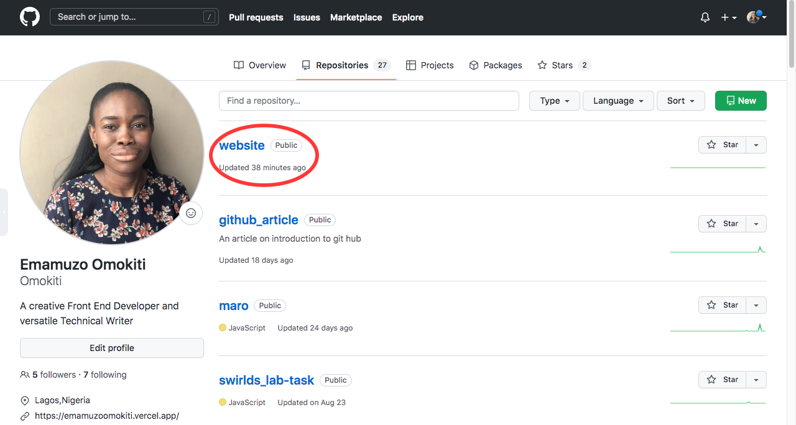
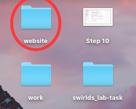
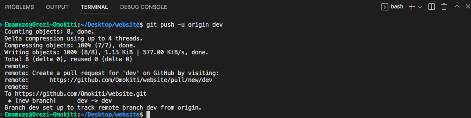

<meta name="description" content="An introductory article to GitHub">


# Introduction to GitHub


# Introduction
 GitHub is an important tool to learn as a developer. By the end of this article, you will learn about GitHub, what is GitHub, why GitHub is important, the difference between GitHub and Git as well as the difference between GitHub Desktop and GitHub CLI, and also how to carry out some basic commands such as clone, pull request and commit.

### What is GitHub
 GitHub has a lot of definitions but I like to define it as an online storage that can be used for storing your code and tracking your code, but there is more to GitHub than that. 


I will be going with the definition from [HubSpot](https://blog.hubspot.com/website/what-is-github-used-for)

> GitHub is an online software development platform. It's used for storing, tracking, and collaborating on software projects.
It makes it easy for developers to share code files and collaborate with fellow developers on open-source projects. GitHub also serves as a social networking site where developers can openly network, collaborate, and pitch their work.


### Why GitHub

There are a lot of advantages that GitHub offers such as;
 
- Great for remote collaboration

Developers  from different parts of the world can work collaboratively with one another.

- Backup

Your code is safe and secure on your repository. In a situation where your system gets faulty or stolen. You can be assured that your code is safe in your repository.

- Community

GitHub has a large community. so imagine your code being seen by the large community.

### Git vs GitHub
Most times we confuse Git for GitHub and vice versa. Well, Git is the  control system that lets you manage and keep track of your source code history and GitHub is the service for projects that use Git. 

There is a significant difference between Git and GitHub according to [intellipaat](https://intellipaat.com/blog/git-vs-github-difference/) some of the difference's are listed below

| Git |   GitHub|
|---|---|
| Developed in the year 2005 by Linus Torvalds  | Developed in the year 2008 and purchased by Microsoft  |
| Focuses on code sharing  | Focuses on source code hosting   |
| Installed locally on a system  |  Hosted on the web   |
| A software tool  | A service tool  |
| Primarily, a command-line tool  | Administered through the web  |
|Doesn’t have a user management feature|Has the user management feature|
| A licensed open-source tool | A pay-for-use tier |
| Has a minimal external tool configuration  | Supports third-party tool integration   |

### GitHub Workflow
GitHub has a lot of commands but for this tutorial, I will touch on three of them which are essential in the GitHub workflow.;

1. Cloning a repository
2. How to commit  
3. Pull request

### Cloning a Repository
As the name implies, Cloning is making a copy of a specific repository. A repository contains all files found in the project i.e source code, images, etc(includes all of your project's files and each file's revision history).

### How to Clone a Repository on GitHub

**Pre-requisite for cloning**

To clone a repo from GitHub, you have to first have an account on [GitHub](https://github.com/).

Let's assume you landed your first gig and you have been given access to the company's repository on GitHub and you need the files on your computer so that you can start working. That is where cloning comes in handy.

There are six steps to clone a repository from GitHub.

**Step 1**
 
From the GitHub landing page click on the **Sign In** button.
 


**Step 2**

Fill in your credentials


**Step 3**

You will be routed to the company's GitHub account. Click on the **Repository** tab.


**Note**: I am using my personal account for the screenshot in step 3. I do not have the right to put a company's GitHub account without permission.

**Step 4**

Click on the Repository that you were given to work on. I will be using the website Repository.



**Step 5**

Click on the green **Code** button. 

You can clone a repository by using any of the method below;
1. Https
2. SSH
3. GitHub CLI


For this article, we would concentrate on the Https method.
Copy the URL https://github.com/Omokiti/website.git

Open your Vscode and click on terminal then new terminal.

if you dont have a vscode you can download it from [Vscode](https://code.visualstudio).


Make sure you are in the correct folder. I am cloning mine to the Desktop folder on my system. 

```
git clone https://github.com/Omokiti/website.git

``` 
Use the command  above to clone the repository. i.e git clone the URL you copied from your company's repo on GitHub and hit enter.


**Step 6**

Go to the folder you cloned your repo, you should be able to see your folder.



### How to do a Commit
A commit is like saving a file after editing it. Remember you are working on the repository you cloned from the Company that just gave you your first gig. 

So assume your first task is to create a sign-in button with red background color on the dev branch and you are done with your task.

So before making a commit you have to first of all run this command in your terminal ;

```
git add .
``` 
The git add informs git that you want to include updates to all the files.

```
git commit -m " "
```
The **m** stands for the message of your commit.

**Note:** Do not commit without a message because providing a commit message helps your team members or anyone that sees your commit know what you are doing. 


After you make the commit. you will run another command 

```
git push -u origin dev 
``` 
git push helps you transfer your commits from your local repo to to a remote repo.

Remember the branch you were assigned to for your task is the dev branch.

You can read more about branches here [Git Branch](https://www.javatpoint.com/git-branch)

**Note:** In another scenario your branch name can be anything you give it.

As the name implies you are pushing your changes to the company's Github account.



```
git push -u origin 
```

### How to do a Pull Request

Once your code have reflected on Github you will have to do a pull request commonly called PR.

 A pull request is informing your company that you have made some updates to the file. In our case we made updates to the Navigation.css style by changing the background color of the sign in button.

**Step 1**

You will get the notification that the branch just had recent push

Click on the **Compare and pull request** button.


**Step 2**

You will compare the dev branch to the main branch.write a comment that shows what your pull request is about and click on the **Create pull request** button.


Your Boss will review your PR and merge it if it meets the task requirement's.

### Difference between GitHub Desktop and GitHub CLI
Git Hub Desktop and GitHub CLI are tools that can be used to create a repo, push, create a pull request etc in GitHub but have significant differences

|  GitHub Desktop | GitHub CLI  |
|---|---|
|GitHub desktop is the GitHub application that you can install  on your system by visiting this [site](https://desktop.github.com/). |GitHub CLI is the Command Line interface tool for GitHub that brings pull requests, issues, GitHub Actions, and other GitHub features to your terminal.  |
| GitHub desktop is a super flexible tool  | GitHub CLI is a bit complex |
| GitHub desktop offers a beautiful and structured User Interface| GitHub CLI offers a black screen|
| It has a specific button for each and every Git command  | Rembering all the commands can be difficult |


### Conclusion
GitHub is an essential tool for every developer. It helps in storing of your code,communication and collaboration with other developers around the world,contributing to open source and also displaying your projects to the world.
I hope that you have learned a lot about GitHub with this article.
