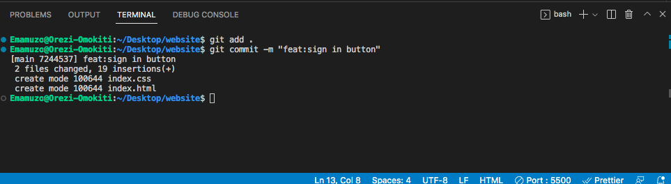
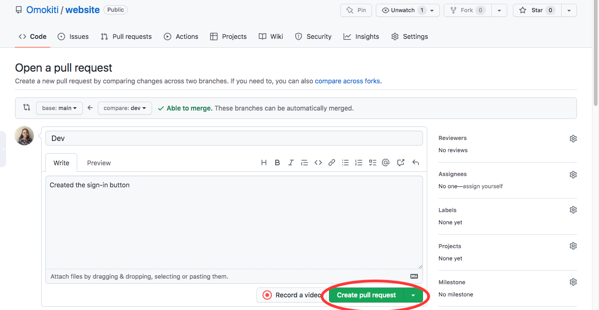

<title>Introduction to GitHub</title>
<meta name="description" content="An introductory article to GitHub">


# Introduction to GitHub


# Introduction
 In this article, we will learn about GitHub, what is GitHub, why GitHub is important, the difference between Git and GitHub, the difference between GitHub Desktop and GitHub CLI, and also how to do some basic commands such as clone, pull request and commit.

### What is GitHub
 GitHub has a lot of definitions but I like to define it as an online storage that can be used for storing your code and tracking your code, but there is more to GitHub than that. 

We will be going with the definition from [liveaboutdotcom](https://www.liveabout.com/what-is-github-and-why-should-i-use-it-2071946).
 
> GitHub is a hosting site where developers and programmers can upload the code they create and work collaboratively to improve it. A defining feature of GitHub is its robust version control system. The version control lets coders tweak software—potentially fixing bugs or improving efficiency—without affecting the software itself or risking the experience of any current users.

### Why GitHub?

There are a lot of advantages that GitHub offers such as;
 
- Great for remote collaboration

Developers  from different parts of the world can work collaboratively with one another.

- Backup

Your code is safe and secure on your repository. In a situation where your system get's faulty or stolen. You can be rest assured that your code is safe in your repository.

- Community

GitHub has a large community. so imagine your code being seen by the large community.

### Git vs GitHub
Most times we  confuse Git for GitHub and vice versa. Well, Git is a version control system that lets you manage and keep track of your source code history and GitHub is a hosting site where developers and programmers can upload the code they create and work collaboratively to improve it.

### GitHub Workflow
GitHub has a lot of commands but for this tutorial, we will touch on three of them which are essential in the GitHub workflow.;

1. Cloning a repository
2. How to commit  
3. Pull request

### Cloning a Repository
As the name implies, Cloning is making a copy of a specific repository. A repository contains all files found in the project i.e source code, images, etc(includes all of your project's files and each file's revision history).

### How to Clone a Repository on GitHub

**Pre-requisite for cloning**

In order to clone a repo from GitHub, you have to first have an account on [GitHub](https://github.com/).

Let's assume you landed your first gig and you have been given access to the company's repository on GitHub and you need the files on your computer so that you can start working. That is where cloning comes in handy.

There are six steps to clone a repository from GitHub.

**Step 1**

From the landing page click on the **Sign In** button.
 


**Step 2**

Fill in your credentials


**Step 3**

You will be routed to the company's GitHub account. Click on the **Repository** tab.


**Note**: I am using my personal account for the screenshot in step 3. I do not have the right to paste a company's own without permission.

**Step 4**

Click on the Repository that you were given to work on. I will be using the maro Repository.


**Step 5**

Click on the green **Code** button. 

You can clone a repository by using any of the method below;
1. Https
2. SSH
3. GitHub CLI


For this article, we would concentrate on the Https method.
Copy the URL "https://github.com/Omokiti/maro.git".
Open your vs code and click on the terminal. 

Make sure you are in the correct directory. I am cloning mine to the "Desktop" folder on my system. 

```
git clone
``` 
Use the command  above to clone the repository. i.e git clone the URL we copied from our repo on GitHub and hit enter


**Step 6**

Go to the directory you cloned your repo, you should be able to see your folder.


### How to do a Commit
A commit is like saving a file after editing it. Remember you are working on the repository you cloned from the Company that just gave you your first gig. 

So assume your first task is to change the background color of the sign-in button color in the Nav bar from blue to red on the dev branch and you are done with your task.

So before making a commit you have to first of all run this command in your terminal ;

```
git add .
``` 
The git add informs git that you want to include updates to a particular file

```
git commit -m ""
```
The **m** stands for the message of your commit.

**Note:** Do not commit without a message. 



After you make the commit. you will run another command 

```
git push -u origin dev 
``` 
Remember the branch you were assigned to for your task is the dev branch.


**Note:** In another scenario your branch name can be anything you give it.

As the name implies you are pushing your changes to the company's Github account.


```
git push -u origin 
```
when you are pushing your work to GitHub for the first time. 

In subsequent push you make you can use only **git push** the name of your branch.

### How to do a Pull Request

Once your code have reflected on Github you will have to do a pull request commonly called PR.

 A pull request is informing your company that you have made some updates to the file. In our case we made updates to the Navigation.css style by changing the background color of the sign in button.

**Step 1**

You will get the notification that the branch just had recent push

Click on the **Compare and pull request** button.


**Step 2**

You will compare the dev branch to the main branch.write a comment that shows what your pull request is about and click on the **Create pull request** button.



**Step 3**

You will be routed to the pull request page scroll down to the bottom of the page and click on the **Merge pull request** button.


you can add an optional description to the description section and click on **Confirm merge** button.


**Step 4**

Your pull request has been successfully merged.


### Difference between GitHub Desktop and GitHub CLI

GitHub desktop is the GitHub application that you can install  on your system by visiting this [site](https://desktop.github.com/).

You can create a repo, push, create a pull request etc with your GitHub desktop app.

**GitHub CLI** is the Command Line interface tool for GitHub that brings pull requests, issues, GitHub Actions, and other GitHub features to your terminal. 

To be able to use Git and its commands on your system terminal you have to configure the GitHub CLI. 

You can install GitHub CLI using this [site](https://github.com/cli/cli#installation)

### Conclusion
Congrats on getting to the end of the article. 
I hope that you have learned a lot about GitHub. 

